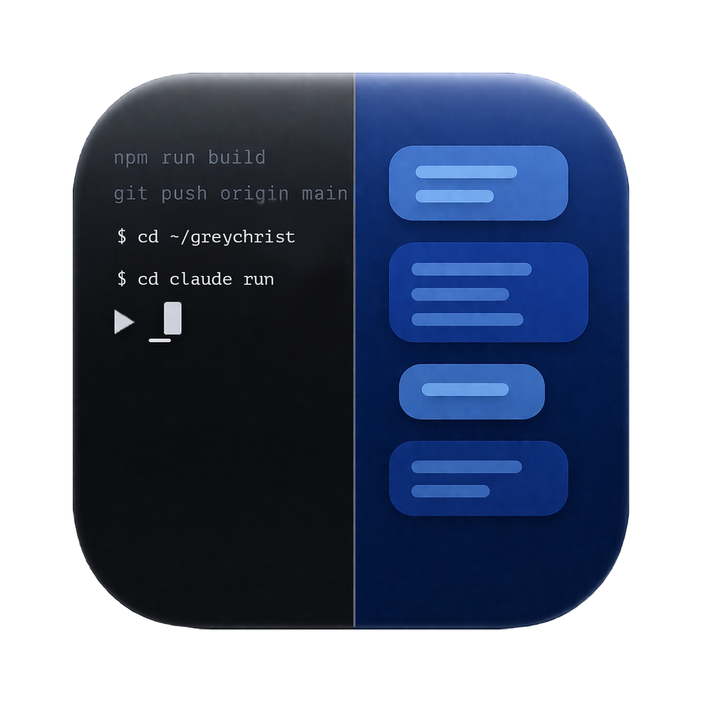

<div align="center">
  

  <h1>OmniFex</h1>

  <p>
    <strong>A desktop GUI for Claude Code with first-class multi-account support.</strong>
  </p>
  <p>
    Route projects to specific accounts, run interactive Claude Code sessions in a rich chat
    or full terminal view, manage MCP servers, slash commands, hooks and permissions, and
    track token usage and rate limits — all without leaving the app.
  </p>
</div>

> [!NOTE]
> This project is not affiliated with, endorsed by, or sponsored by Anthropic. Claude is a trademark of Anthropic, PBC. This is an independent project that drives the Claude Code CLI you install yourself.
>
> OmniFex is a long-running fork of [opcode](https://github.com/getAsterisk/opcode) by Asterisk, licensed under AGPL-3.0. It has since been rewritten on Electron and reshaped around multi-account workflows; little of the original Tauri/Rust codebase remains.

## Status

OmniFex is **macOS (Apple Silicon) only** and ships as an **unsigned** build. macOS Gatekeeper will block the first launch — right-click → **Open** to bypass it once. A proper Developer ID signature is on the roadmap.

The app drives the **Claude Code CLI** directly (via `node-pty` for terminal mode and `child_process` for structured streaming), so a working, authenticated Claude Code install is required. There is no web/REST mode and OmniFex bundles no model of its own.

## Features

### Multi-account routing
- Bind projects to specific Claude accounts using path-prefix rules, with **longest-match-wins** resolution and explicit per-project overrides.
- Auto-discover existing accounts on your machine and scan for new ones.
- Every session, agent, hook, MCP call, usage read, and CLAUDE.md edit runs under the resolved account's `CLAUDE_CONFIG_DIR`.
- An account-resolution explainer shows exactly why a given project maps to a given account.

### Interactive sessions
- **Two view modes** for the same live session: a structured **rich chat** (streaming JSON) with tool-call widgets, and a full **terminal (TUI)** view backed by the real CLI. Toggle between them mid-session.
- Live controls in rich mode: **model picker**, **reasoning effort** (low → max), **extended-thinking** config, and **permission mode** (default / acceptEdits / bypassPermissions / plan).
- **Slash-command picker** (`/`) plus per-session command discovery.
- **Subagent tracking** — subagent runs are surfaced inline with their model and authoritative end-of-run stats (duration, tokens, tool count).
- Image attachments, in-session find, permission and elicitation prompts, and per-tab context-usage / cost readouts.
- Multi-tab layout with per-tab status glyphs (session state, engine, rate-limit warnings) and an aggregate status popover.

### Multi-engine (Claude + Codex)
- **Claude Code** is fully wired: sessions, agents, MCP, hooks, slash commands, permissions, and usage.
- **OpenAI Codex** is partially wired today: you can create Codex-engine accounts and sign in (OAuth via `codex login`, or `OPENAI_API_KEY`), and browse on-disk Codex sessions. Full Codex session execution is still in progress.

### MCP server management
- Add, edit, remove, and test MCP servers (command- or URL-based) from the UI.
- Import server configs from Claude Desktop.
- Scope servers at the user, local, or project level, and view live per-session server status.

### Slash commands, hooks & permissions
- Create and manage custom **slash commands** (with `description` and `allowed-tools` frontmatter) at user, local, or project scope.
- View, edit, and validate Claude Code **hooks** across scopes.
- Edit **permission rules** (allow/deny) at user, local, or project scope; new rules are pushed live to the active session.

### Usage analytics
- Aggregate token usage and estimated cost across every configured account.
- Break down by model, project, and date range, with per-account comparison.

### Rate limits
- Scrape the CLI `/usage` view to capture five-hour and weekly **utilization %** and reset times.
- Store rate-limit snapshots per account and fire **threshold notifications** (with configurable percentages and sounds) as you approach a limit.

### CLAUDE.md & session summaries
- Inline editor with live preview for CLAUDE.md files.
- On-demand, cached **session summaries** generated by a model call.

### Git awareness
- Show the current branch per project, list **git worktrees**, and assign **per-project branch colors**.
- A lightweight watcher refreshes the branch badge as your working tree changes.

### Appearance & the rest
- Deep theming: color palettes, typography, terminal fonts, and per-message-kind icons, with JSON export/import.
- **Lima VM viewer** — list and start/stop Lima VMs and their Docker containers.
- HTTP/HTTPS **proxy** settings, OS **notifications** with sound preview, and an in-app **auto-updater** that pulls new builds from GitHub Releases.

## Install

### Download (recommended)

Grab the latest macOS arm64 build from the [Releases page](https://github.com/greychrist/omnifex/releases/latest):

- `OmniFex-<version>-arm64.dmg` — drag-install to `/Applications`.
- `OmniFex-darwin-arm64-<version>.zip` — used by the in-app auto-updater.

On first launch macOS will refuse to open the app because it isn't signed by a Developer ID — right-click the app icon and choose **Open**, then confirm. You only need to do this once.

Once installed, OmniFex checks `releases/latest` on launch and offers in-place updates when a new version is published.

### Prerequisites

- **Claude Code CLI** installed and authenticated. See [Anthropic's setup guide](https://docs.anthropic.com/en/docs/claude-code).
- Apple Silicon Mac running a current macOS.
- *(Optional)* the **Codex CLI** and **Lima** on your `PATH` if you want the Codex-account and VM-viewer features.

## Build from source

```bash
git clone https://github.com/greychrist/omnifex.git
cd omnifex
npm install
npm start            # run in dev (Electron Forge + Vite)
```

For a production build:

```bash
npm run make         # produces .dmg and .zip in out/make/
```

Other useful scripts:

```bash
npm run check              # tsc --noEmit across renderer and main process
npm test                   # vitest one-shot
npm run test:coverage
npm run rebuild:electron   # rebuild better-sqlite3 / node-pty for Electron's ABI
```

## Tech stack

- **Runtime**: Electron 41 (Node 22, Chromium)
- **Renderer**: React 18 + TypeScript + Vite 6 + Tailwind v4 + Radix / shadcn
- **Main process**: TypeScript on Node, services wired through a typed, allow-listed IPC layer
- **Persistence**: `better-sqlite3`
- **Terminal**: `node-pty` + `@xterm/xterm`
- **Claude/Codex integration**: drives the CLI binaries directly — `node-pty` for terminal mode, `child_process` streaming JSON for the rich engine

## Project structure

```
omnifex/
├── electron/              # Main process
│   ├── main.ts            # App bootstrap, service wiring
│   ├── preload.ts         # IPC allow-list
│   ├── ipc/               # IPC handlers + channel registry
│   ├── services/          # Business logic
│   │   ├── accounts.ts    #   multi-account resolution & path rules
│   │   ├── sessions/      #   session lifecycle, TUI, permissions, subagents
│   │   ├── agents/        #   Claude & Codex engine layer
│   │   ├── auth/          #   Codex auth
│   │   ├── usage*.ts      #   usage aggregation + /usage scraping
│   │   ├── rate-limits.ts #   rate-limit snapshots & notifications
│   │   ├── mcp.ts         #   MCP management
│   │   └── …              #   slash commands, hooks, lima, git, updater, …
│   └── __tests__/         # Vitest suites for main-process code
├── src/                   # Renderer (React)
│   ├── components/        # UI (sessions, accounts, MCP, usage, settings, …)
│   ├── contexts/          # Theme, tabs, accounts, message rendering
│   ├── stores/            # Zustand stores
│   └── lib/               # Typed API surface (api.ts) + IPC adapter
├── icons/                 # App icon assets
└── assets/                # Source design files (PSDs, audio)
```

## Security and privacy

- All persistence is local (SQLite + your existing Claude/Codex config dirs). No telemetry, no analytics, no remote logging.
- OmniFex talks to model providers only through the CLI binaries you install and authenticate; it sends nothing to Anthropic or OpenAI itself.
- Per-session permission gating for tool use, mirroring Claude Code's native permission model.

## License

AGPL-3.0 — see [LICENSE](LICENSE).

OmniFex is published by GreyChrist.

## Acknowledgments

- Originally forked from [opcode](https://github.com/getAsterisk/opcode) by [Asterisk](https://asterisk.so/).
- Built on [Electron](https://www.electronjs.org/) and [Claude Code](https://docs.anthropic.com/en/docs/claude-code).
- [Claude](https://claude.ai) by Anthropic.
